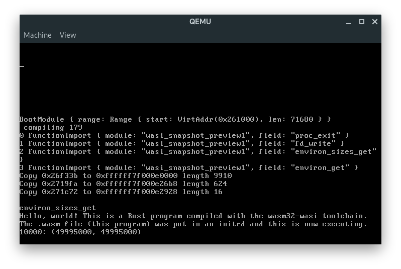

# Kwast

[](./LICENSE) [](https://travis-ci.com/kwast-os/kwast)

**Kwast** (will be) an operating system, written in Rust, running WebAssembly. It uses a microkernel architecture for flexibility.

Since WebAssembly was designed to be a safe language, we can run it without having to use hardware usermode and multiple address spaces (optionally).
Processes can be run in the same address space (multiple SIPs in a single hardware protection domain), or in seperate address spaces.
This enables low-cost context switches, low-cost syscalls, and a microkernel design without a big performance hit.
Another interesting thing is that it means the software is cross-platform and that the compiler could enable platform-specific optimisations.

For notes on Spectre, Meltdown and other related issues, see [#10](https://github.com/nielsdos/kwast/issues/10).
An additional idea is to allow to use optional hardware protection domains in the future if requested.

## Contents

* [Current status](#current_status)
* [Getting started](#getting_started)
* [Short-term goals](#short_term_goals)
* [Built with](#built_with)
* [Similar projects](#similar_projects)

## <a name="current_status"> Current status </a>

Currently, it runs basic WebAssembly code in a basic multitasked environment.
The heap uses a slab allocator design, and the virtual memory areas are managed by an AVL tree.
For the ABI, I started with implementing [WASI](https://github.com/WebAssembly/WASI).

Here's a screenshot of a WASI compiled Rust program ([userspace/wasm-test](userspace/wasm-test)).


## <a name="getting_started"> Getting started </a>

These instructions help you get started with building the source and getting it to run.

### Requirements

* make
* grub-mkrescue (you might also need to install xorriso)
* qemu-system-x86_64
* Rust and Cargo
* Optionally wasm-strip (from [wabt](https://github.com/WebAssembly/wabt)), which reduces the binary size

### Setting up a toolchain

You can setup your toolchain using the following steps:
```bash
# (Inside the project root folder.)
# You'll need to get the rust nightly and install the wasi toolchain:
rustup component add rust-src
rustup target add wasm32-wasi

# You'll also need a cross-compile binutils, I wrote a bash script that builds this for you.
cd toolchain
./setup_cross_binutils.sh
```
Now you're ready to build and run the project!

### Building & Running

There's currently a Makefile in the `kernel` folder. The **Makefile** there provides some rules:

```bash
# (Inside the project root folder.)
make run # Builds iso and start a QEMU virtual machine

# If you don't want to run, but only build a bootable ISO:
make iso

# You can make a release build using:
make iso BUILD=release # (or run)

# You can run tests using
./run_tests
```

## <a name="short_term_goals"> Short-term goals </a>

* Simple PS/2 server & similar small servers
* Run basic programs
* SMP

## <a name="built_with"> Built with </a>

* [Cranelift](https://github.com/bytecodealliance/wasmtime/tree/main/cranelift) - Code generator used to parse & run WebAssembly. Kwast uses a fork of Cranelift to let it work in a no_std environment.

* To integrate Cranelift, [wasmtime](https://github.com/bytecodealliance/wasmtime/) has been used as a reference implementation, which is licensed under the [Apache License 2.0](https://github.com/bytecodealliance/wasmtime/blob/main/LICENSE).

* [Spleen font](https://github.com/fcambus/spleen) - Spleen is a monospaced bitmap font licensed under the [BSD 2-Clause "Simplified" License](https://github.com/fcambus/spleen/blob/master/LICENSE).

## <a name="similar_projects"> Similar projects </a>
* [Nebulet](https://github.com/nebulet/nebulet) - A microkernel that implements a WebAssembly "usermode" that runs in Ring 0
* [wasmjit](https://github.com/kenny-ngo/wasmjit) - Small Embeddable WebAssembly Runtime
* [cervus](https://github.com/cervus-v/cervus) - A WebAssembly subsystem for Linux
